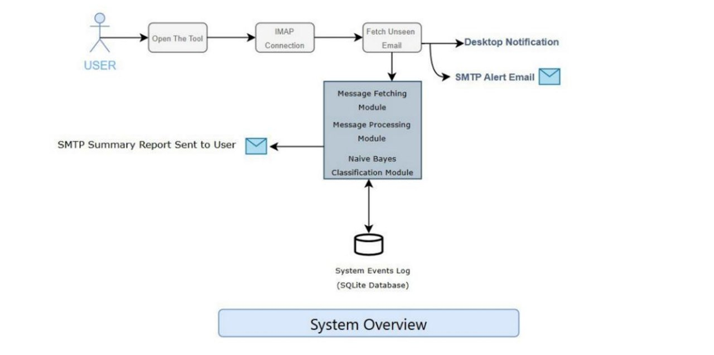
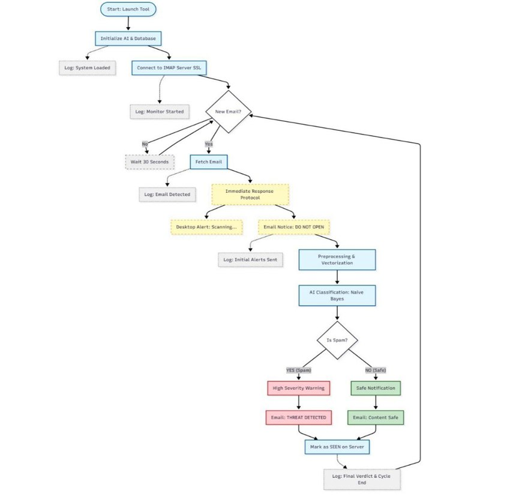
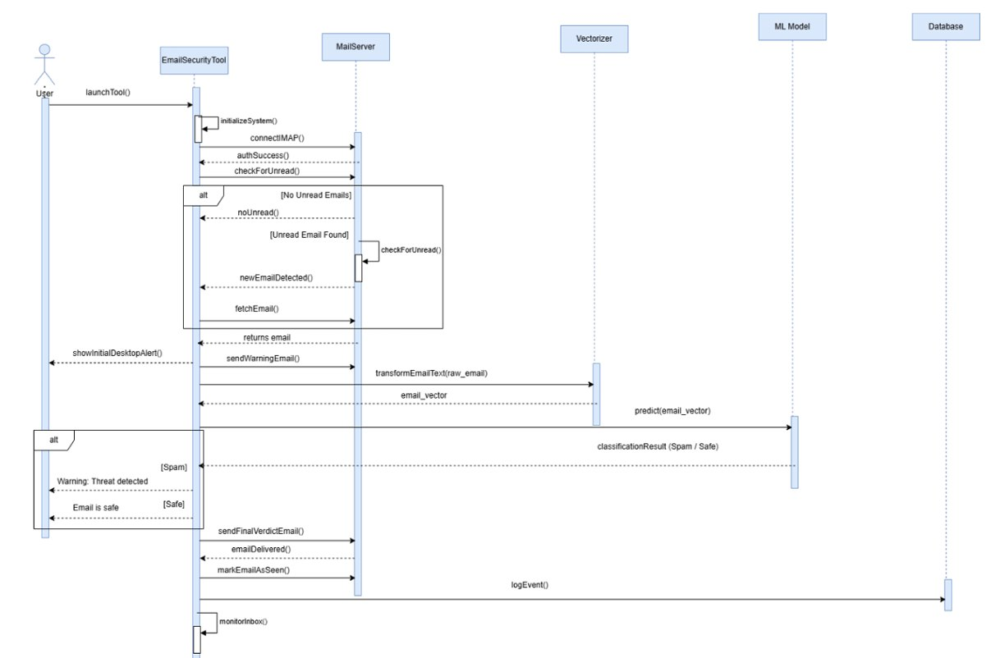

# Intelligent Email Monitoring & Classification Tool

## Overview

This project is a Machine Learning-based email monitoring and classification tool developed using Python and Machine Learning. It retrieves incoming emails, analyzes their content, classifies them as **Spam** or **Not Spam**, sends automated notifications before and after classification, and stores activity logs in a SQLite database.

The project demonstrates the integration of machine learning with email protocols to automate email analysis and notification workflows.

---

## System Overview

The system architecture illustrates the overall structure and major components of the email monitoring and classification tool. It shows how the monitoring engine, machine learning model, notification services, and SQLite database interact to retrieve, process, classify, notify, and log email activity.

---

## Key Features

* Retrieve unread emails using IMAP.
* Preprocess email content for machine learning classification.
* Classify emails as **Spam** or **Not Spam**.
* Send automated email and desktop notifications before and after classification.
* Store email activity, classification results, and notifications in SQLite.
* Maintain detailed logs for monitoring and auditing.

---

## System Workflow

1. Connect to the email server using IMAP.
2. Retrieve unread emails.
3. Preprocess the email content.
4. Classify the email using the trained machine learning model.
5. Send desktop and email notifications.
6. Log all events and classification results into SQLite.

---

## Flowchart Diagram

The flowchart illustrates the complete workflow of the email monitoring and classification tool, from system initialization and email retrieval to message processing, classification, notifications, and database logging. Each detected email follows an independent processing cycle, while system events and results are continuously recorded in the SQLite database.

---

## Sequence Diagram

The sequence diagram illustrates the chronological interactions between the system components throughout the email monitoring and classification process. It shows the flow from system initialization and IMAP connection through email detection, pre-analysis notifications, machine learning classification, final alerts, and event logging in the SQLite database.

---

## Technologies

* Python
* Machine Learning
* Scikit-learn
* SQLite
* IMAP
* SMTP

---

## Project Highlights

* Developed a Machine Learning-based email monitoring and classification tool using Python.
* Built a machine learning model to classify emails as **Spam** or **Not Spam**, achieving **98.5% classification accuracy**.
* Integrated **IMAP** for email retrieval and **SMTP** for automated notifications before and after email classification.
* Designed a **SQLite** database to store email activity, classification results, and notification logs.

---

## Technology Stack

| Component             | Technology   |
| --------------------- | ------------ |
| Programming Language  | Python       |
| Machine Learning      | Scikit-learn |
| Database              | SQLite       |
| Email Retrieval       | IMAP         |
| Email Notifications   | SMTP         |
| Desktop Notifications | Plyer        |

---
